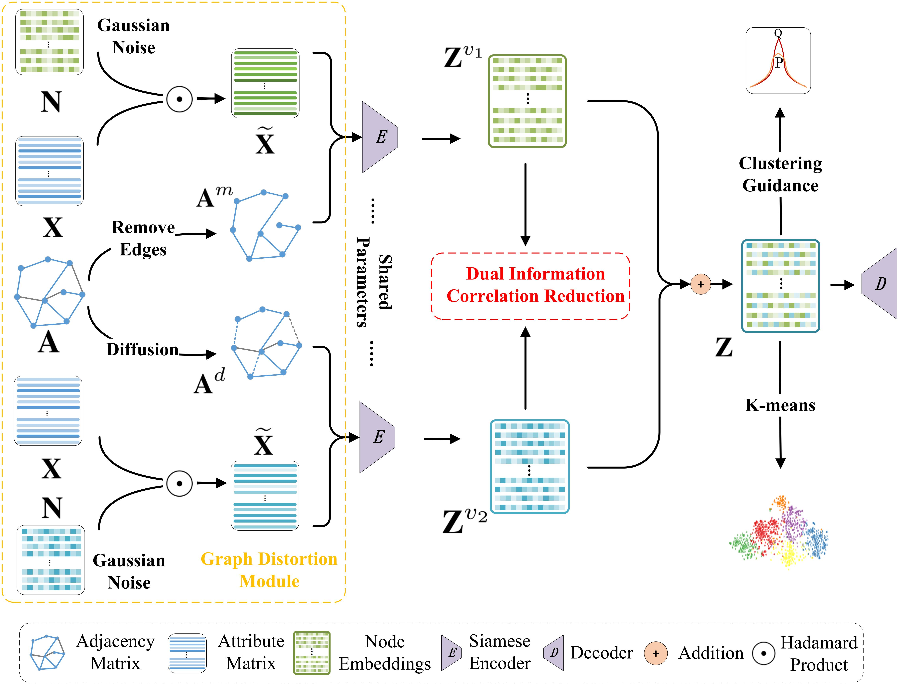

# Dual Correlation Reduction Network

<p align="center">   
    <a href="https://pytorch.org/" alt="PyTorch">
      </a>
    <a href="https://aaai.org/Conferences/AAAI-22/" alt="Conference">
        </a>
</p>
An official source code for paper ''**Deep Graph Clustering via Dual Correlation Reduction**'', accepted by AAAI 2022. Any communications or issues are welcomed. Please contact yueliu19990731@163.com. If you find this repository useful to your research or work, it is really appreciate to star this repository. :heart:

-------------

### Overview

<p align = "justify"> 
    <a href="https://github.com/yueliu1999/Awesome-Deep-Graph-Clustering">Deep graph clustering</a>, which aims to reveal the underlying graph structure and divide the nodes into different groups, has attracted intensive attention in recent years. However, we observe that, in the process of node encoding, existing methods suffer from representation collapse which tends to map all data into a same representation. Consequently, the discriminative capability of node representations is limited, leading to unsatisfied clustering performance. To address this issue, we propose a novel self-supervised deep graph clustering method termed <b>D</b>ual <b>C</b>orrelation <b>R</b>eduction <b>N</b>etwork (<b>DCRN</b>) by reducing information correlation in a dual manner. Specifically, in our method, we first design a siamese network to encode samples. Then by forcing the cross-view sample correlation matrix and cross-view feature correlation matrix to approximate two identity matrices, respectively, we reduce the information correlation in dual level, thus improve the discriminative capability of the resulting features. Moreover, in order to alleviate representation collapse caused by over-smoothing in GCN, we introduce a propagation-regularization term to enable the network to gain long-distance information with shallow network structure. Extensive experimental results on six benchmark datasets demonstrate the effectiveness of the proposed DCRN against the existing state-of-the-art methods.
</p>
<div  align="center">    
    
</div>

<div  align="center">    
    Illustration of the Dual Correlation Reduction Network (DCRN).
</div>


------

### requirements

The proposed DCRN is implemented with python 3.8.5 on a NVIDIA 3090 GPU. 

Python package information is summarized in **requirements.txt**:

- torch==1.8.0
- tqdm==4.50.2
- numpy==1.19.2
- munkres==1.1.4
- scikit_learn==1.0.1


### Quick Start

- step1:  download the dataset from [Awesome Deep Graph Clustering](https://github.com/yueliu1999/Awesome-Deep-Graph-Clustering) and unzip them into **./dataset**
- step2:  run **python main.py --name dblp**. The name parameter is the name of dataset


### Results


### Citation

```
@inproceedings{
}
```


