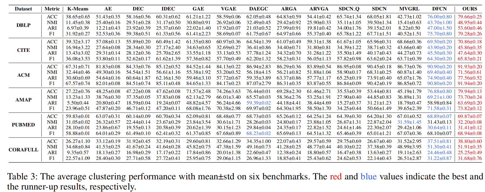
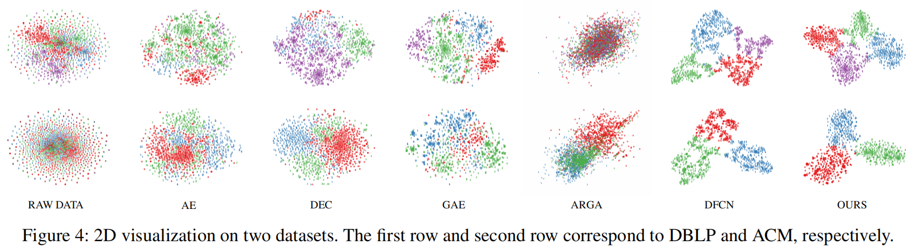

[stars-img]: https://img.shields.io/github/stars/yueliu1999/DCRN?color=yellow
[stars-url]: https://github.com/yueliu1999/DCRN/stargazers
[fork-img]: https://img.shields.io/github/forks/yueliu1999/DCRN?color=lightblue&label=fork
[fork-url]: https://github.com/yueliu1999/DCRN/network/members
[visitors-img]: https://visitor-badge.glitch.me/badge?page_id=yueliu1999.DCRN
[adgc-url]: https://github.com/yueliu1999/DCRN

# Dual Correlation Reduction Network

<p align="center">   
    <a href="https://pytorch.org/" alt="PyTorch">
      </a>
    <a href="https://aaai.org/Conferences/AAAI-22/" alt="Conference">
        </a>
<p/>


[![GitHub stars][stars-img]][stars-url]
[![GitHub forks][fork-img]][fork-url]
[![visitors][visitors-img]][adgc-url]


An official source code for paper [Deep Graph Clustering via Dual Correlation Reduction](https://www.researchgate.net/profile/Yue-Liu-240/publication/357271184_Deep_Graph_Clustering_via_Dual_Correlation_Reduction/links/61c466e68bb20101842f9a92/Deep-Graph-Clustering-via-Dual-Correlation-Reduction.pdf), accepted by AAAI 2022. Any communications or issues are welcomed. Please contact yueliu19990731@163.com. If you find this repository useful to your research or work, it is really appreciate to star this repository. :heart:

-------------

### Overview

<p align = "justify"> 
    <a href="https://github.com/yueliu1999/Awesome-Deep-Graph-Clustering">Deep graph clustering</a>, which aims to reveal the underlying graph structure and divide the nodes into different groups, has attracted intensive attention in recent years. However, we observe that, in the process of node encoding, existing methods suffer from representation collapse which tends to map all data into a same representation. Consequently, the discriminative capability of node representations is limited, leading to unsatisfied clustering performance. To address this issue, we propose a novel self-supervised deep graph clustering method termed <b>D</b>ual <b>C</b>orrelation <b>R</b>eduction <b>N</b>etwork (<b>DCRN</b>) by reducing information correlation in a dual manner. Specifically, in our method, we first design a siamese network to encode samples. Then by forcing the cross-view sample correlation matrix and cross-view feature correlation matrix to approximate two identity matrices, respectively, we reduce the information correlation in dual level, thus improve the discriminative capability of the resulting features. Moreover, in order to alleviate representation collapse caused by over-smoothing in GCN, we introduce a propagation-regularization term to enable the network to gain long-distance information with shallow network structure. Extensive experimental results on six benchmark datasets demonstrate the effectiveness of the proposed DCRN against the existing state-of-the-art methods.
</p>
<div  align="center">    
    
</div>


<div  align="center">    
    Illustration of the Dual Correlation Reduction Network (DCRN).
</div>


### Requirements

The proposed DCRN is implemented with python 3.8.5 on a NVIDIA 3090 GPU. 

Python package information is summarized in **requirements.txt**:

- torch==1.8.0
- tqdm==4.50.2
- numpy==1.19.2
- munkres==1.1.4
- scikit_learn==1.0.1


### Quick Start

- Step1: use the **dblp.zip** file or download other datasets from [Awesome Deep Graph Clustering/Benchmark Datasets](https://github.com/yueliu1999/Awesome-Deep-Graph-Clustering#benchmark-datasets) 

- Step2: unzip the dataset into the **./dataset** folder

- Step3: run 

  ```
  python main.py --name dblp --seed 3 --alpha_value 0.2 --lambda_value 10 --gamma_value 1e3 --lr 1e-4
  ```

Parameter setting

- name: the name of dataset
- seed: the random seed. 10 runs under different random seeds.
- alpha_value: the teleport probability in graph diffusion
  - PUBMED: 0.1
  - DBLP, CITE, ACM, AMAP, CORAFULL: 0.2
- lambda_value: the coefficient of clustering guidance loss.
  - all datasets: 10
- gamma_value: the coefficient of propagation regularization
  - all datasets: 1e3
- lr: learning rate
  - DBLP 1e-4
  - ACM: 5e-5
  - AMAP: 1e-3
  - CITE, PUBMED, CORAFULL: 1e-5


Tips: Limited by the GPU memory, PUBMED and CORAFULL might be out of memory during training. Thus, we adpot batch training on PUBMED and CORAFULL dataseets and the batch size is set to 2000. Please use the batch training version of DCRN [here](https://drive.google.com/file/d/185GLObsQQL3Y-dQ2aIin5YrXuA-dgpnU/view?usp=sharing).


### Results

<div  align="center">    
    
</div>


<div  align="center">    
    
</div>


### Citation

If you use code or datasets in this repository for your research, please cite our paper.

```
@inproceedings{DCRN,
  title={Deep Graph Clustering via Dual Correlation Reduction},
  author={Liu, Yue and Tu, Wenxuan and Zhou, Sihang and Liu, Xinwang and Song, Linxuan and Yang, Xihong and Zhu, En},
  booktitle={Proceedings of the AAAI Conference on Artificial Intelligence},
  volume={36},
  number={7},
  pages={7603-7611},
  year={2022}
}

@article{Deep_graph_clustering_survey,
 author = {Liu, Yue and Xia, Jun and Zhou, Sihang and Wang, Siwei and Guo, Xifeng and Yang, Xihong and Liang, Ke and Tu, Wenxuan and Li, Z. Stan and Liu, Xinwang},
 journal = {arXiv preprint arXiv:2211.12875},
 title = {A Survey of Deep Graph Clustering: Taxonomy, Challenge, and Application},
 year = {2022}
}
```


